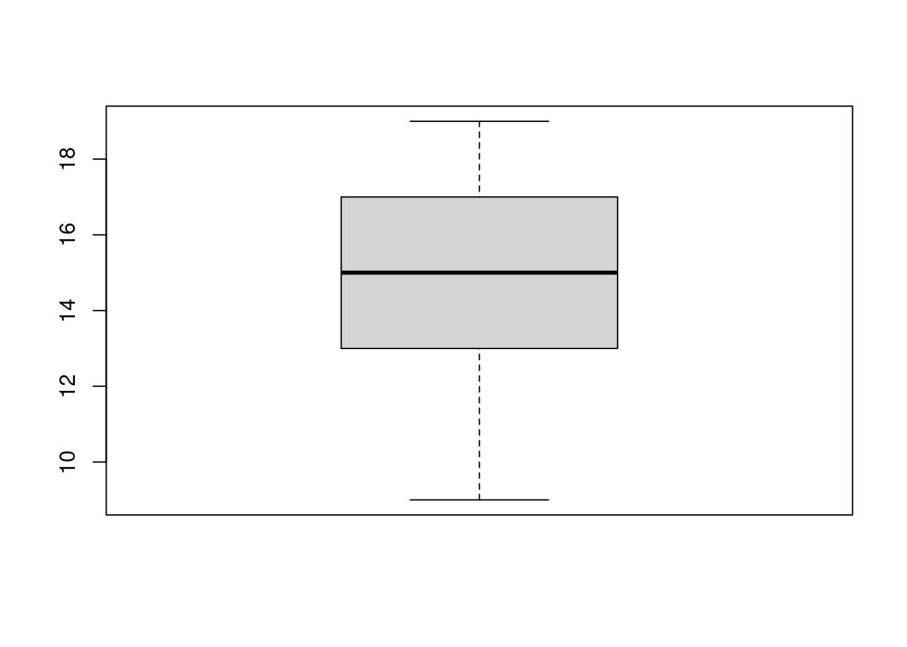

# Centralización y dispersión


En el [capítulo](#distribuciones-de-frecuencias) \@ref(distribuciones-de-frecuencias) vimos que resumir los datos y generar visualizaciones nos permite entender mejor la estructura y algunas propiedades de un conjunto de datos, como son sus vales más frecuentes y rango de observaciones. En este capítulo desarrollaremos algunas medidas cuantitativas más precisas de estas propiedades. Específicamente desarrollaremos medidas de centralización o tendencia central y dispersión. 

## Centralización

La *centralización* o *tendencia central* de un conjunto de datos es uno o un número reducido de valores que representan todo el conjunto.  

Existen tres medidas de *centralicación*: *la media*, *la mediana* y *la moda*. A continuación las vamos a definir y ver cómo se calculan y luego vamos a considerar cuándo se debe usar cada una de ellas. 

### La media

La media es seguramente la medida de centralización de uso más frecuente ^[y por ende de más uso incorrecto]. Se conoce también como *el promedio* y, más técnicamente, *la media arithmetica*. La media se obtiene por la suma de las observaciones dividido por el número de observaciones. Por ejemplo si queremos sacar el promedio de seis observaciones de una variable: 15, 12, 11, 18, 15 y 15; tenemos:

\begin{equation}
{{15 + 12 + 11 + 18 + 15 + 15}\over{6}}={86\over6}=14,33
(\#eq:media-de-seis-observaciones)
\end{equation}


En el caso de nuestra muestra de notas para de capítulos anteriores tenemos:


\begin{equation}
{{ 15 + 12 + 11 + 18 + 15 + 15+ \\
  9 + 19 + 14 + 13 + 11 + 12 + \\
  18 + 15 + 16 + 14 + 16 + 17 + \\
  15 + 17 + 13 + 14 + 13 + 15 + \\
  17 + 19 + 17 + 18 + 16 + 14}\over{30}}={448\over30}=14.93
  (\#eq:media-de-treinta-observaciones)
\end{equation}

Ya con el cómputo en \@ref(eq:media-de-treinta-observaciones) nos damos cuenta de que si bien es posible hacer estos cálculos a mano puede resultar bastante engorroso. Además con tantos números dando vuelta sube la probabilidad de un error de tipeo y con lo cual sacaríamos un resultado incorrecto.

::: {.example #unnamed-chunk-2 name="Ejemplo en R"}
:
:::

Por suerte es bastante sencillo sacar la media con R. Para los dos ejemplos anteriores tenemos:


```r
x = c(15, 12, 11, 18, 15 , 15)
mean(x)
```

```
#> [1] 14.33333
```

y 


```r
notas = c(15, 12, 11, 18, 15, 15, 9, 19, 14, 13, 11, 12, 18, 
           15, 16, 14, 16, 17, 15, 17, 13, 14, 13, 15, 17, 19, 
           17, 18, 16, 14)
mean(notas)
```

```
#> [1] 14.93333
```


#### Notación matemática {-}

En textos de matemática y estadística se usa con frecuencia *llaves* para significar un conjunto, de modo que los datos del primer conjunto se expresaría así: x = {15, 12, 11, 18, 15 , 15}.

Una notación compacta para significar la suma de las observaciones en una variable es $\Sigma$: la letra griega sigma, en mayúscula. 

Para significar el número de observaciones de usa N, de **n**úmero. 

Así se puede definir la media de manera compacta así:
$$
{\Sigma{x}}\over{N}
$$


También se usa una barra vertical sobre el nombre de la variable para significar la media (o promedio aritmético): por ejemplo: $$\bar{x} = 14,33$$

Entonces en general tenemos:

::: {.definition #unnamed-chunk-5 name="La media"}
$$
\bar{x} = {\Sigma{x}\over{N}}
$$
:::

que se podría leer: «la media de equis es igual a la suma de las observaciones de equis sobre el número de observaciones».

### La mediana

Otra medida de centralización es la mediana (también: valor mediano). Para obtenerla ponemos nuestros datos en orden ascendiente y sacamos el valor que está justo en la mitad. Por ejemplo: si queremos sacar la mediana de {15, 12, 11, 18, 15, 15, 9}, primero los ordenamos:
{9, 11, 12, 15, 15 ,15, 18}. Vemos que hay siete observaciones con lo cual la mediana es la observación que está en cuarta posición, es decir que la mediana de estos datos es 15. Si el conjunto de datos tiene un número par de observaciones, no va a haber una observación justo en el medio. En ese caso se toman los *dos* valores del medio, se los suma y se divide por dos^[]. Por ejemplo: {8, 8, 9, 11, 12, 15, 15 ,15}. Acá tenemos ocho observaciones (ya ordenados) tomamos los dos valores de la posición cuarta y quinta, los sumamos y dividimos por dos: ${11+12\over2}=11,5$.

#### Notación matemática {-}

El valor mediano, o la mediana, se denota en notación matemática con una tilde como la que se usa en la letra ñ en español. Al igual que la barra para la media, se coloca por encima de la variable, así: $$\huge{\tilde{x}}$$.

::: {.example #unnamed-chunk-6 name="Ejemplo en R"}
:
:::

Al igual que la media podemos sacar la mediana de forma sencilla con R con la función ```median```.


```r
x = c(9, 11, 12, 15, 15 ,15, 18)
median(x)
```

```
#> [1] 15
```

y


```r
x = c(8, 8, 9, 11, 12, 15, 15 ,15)
median(x)
```

```
#> [1] 11.5
```


### La moda

*La moda* es la observación más frecuente del conjunto. Por ejemplo: {9, 11, 12, 15, 15 ,15, 18}. El valor 15 es la moda de estos datos.

A diferencia de las otras medidas de centralidad la moda no necesariamente es un valor único. Si tuviéramos por ejemplo: {2, 4, 5, 7, 7, 7, 9, 11, 12, 15, 15, 15, 18} hay dos valores con la misma frecuencia máxima. Tanto 7 como 15 aparecen tres veces. En este caso hay dos modas y hablamos de una distribución *bimodal*.

Vemos un ejemplo en el gráfico que sigue.


### ¿Cuál usar?

La selección de una medida de centralización depende de varios factores:

1. La escala de medición de la variable (nominal, ordinal, de intervalo o de razón)
2. La forma de la distribución - si hay sesgo o no
3. Para qué vamos a usar la medida. 

La media debería usarse solo para variables de escala de intervalo o de razón. Si los datos son ordenables, pero sin que se pueda hablar de distancias reales entre los datos la mediana es más apropiada. Y en los casos donde ni esto es posible la moda puede ser la única medida disponible. Por ejemplo: si decimos que Italia es un país católico estamos expresando la moda de la variable nominal «religión», y si decimos que Alemania es un país católico y protestante estamos expresando una distribución bimodal de la misma variable. Podemos observar en el gráfico que en realidad se podría hablar incluso de una distribución trimodal.

<div class="figure">

<p class="caption">(\#fig:unnamed-chunk-10)Religión en Alemania</p>
</div>


En cuanto a la forma de la distribución se favorece la mediana por sobre la media si la distribución es muy sesgada. Esto ocurre sobre todo si hay valores extremos o atípicos. Por ejemplo si tenemos los datos: {15, 12, 11, 18, 15, 15, 200} está claro que si calculamos la media el valor extremo (200) va influir mucho más que cualquier otra observación. En este caso la media es 40,85 y el mediano 15. El primer valor (40,85) no es muy representativo de la muestra ya que no corresponde a ninguna observación y está lejos de cualquiera de ellas. El mediano, en cambio, puede resultar una mejor medida en este caso. 

<div class="figure">

<p class="caption">(\#fig:unnamed-chunk-11)Medidas de centralización en una distribución con sesgo positivo</p>
</div>

Para darnos cuenta de cuál de las medidas puede ser la más adecuada si tenemos datos por lo menos numéricos podemos sacar las tres medidas y ver qué tanto de asemejan unas a otras. Hay que tener en mente que *cualiér distribución de datos reales va a tener un sesgo*, la distribución perfectamente normal solo existe en teoría. Entonces debemos fijarnos si el sesgo que tenemos justifica el uso de una medida en espeficia. Por ejemplo, para nuestros datos de notas de dos grupos tenemos: 

* Grupo A
  * Media: 14,93
  * Mediana: 15
  * Moda: 15
  
* Grupo B:
  * Media: 11,76  
  * Mediana: 12  
  * Moda: 12
  
Vemos que hay muy poca diferencia entre las tres medidas por lo cual vamos a concluir que el sesgo observado no es lo suficientemente fuerte como para justificar el uso de otra medida que *la media*. 


## Medidas de dispersión

En la sección anterior desarrollamos varias medidas de centralización y cuál eligir para describir el valor «más típico» de los datos. Cuando calculamos medidas de dispersión estamos contestando la pregunta: ¿cuán típico es este valor?

Cuando tratamos con variables nominales, como el ejemplo de religión en Alemania de la sección anterior, lo mejor que podemos hacer el indicar la proporción o porcentaje^[Las dos medidas son equivalentes ya que: 0,1 = 10%; 0,5 = 50% etcétera. En estadística y matemática se prefiere generalmente la expresión de proporción porque facilita ciertas operaciones aritméticas.], pero si los datos son de alguna escala ya numérica tenemos algunas posibilidades que nos permiten más exactitud.  

### Rango o amplitud

El rango de un conjunto de datos son dos números: el valor mínimo y el valor máximo. Por ejemplo el conjunto de datos {9, 11, 12, 15, 15 ,15, 18} tiene un rango 9 a 18; y el conjunto {2, 4, 5, 7, 7, 7, 9, 11, 12, 15, 15 ,15, 18} tiene un rango de 2 a 18. 

En castellano se usa con alguna frecuencia también el término *amplitud* como equivalente a *rango*.

::: {.example #unnamed-chunk-12 name="Ejemplo en R"}
:
:::

Para sacar el rango de un conjunto de datos en R podemos usar la función ```range```. Así:


```r
x = c(2, 4, 5, 7, 7, 7, 9, 11, 12, 15, 15 ,15, 18)
range(x)
```

```
#> [1]  2 18
```


### El rango intercuartílico

Otra medida de dispersión que tenemos a disposición es el *rango intercuartílico* o *rango intercuartíl*. Para calcularlo dividimos las observaciones en cuatro partes iguales y sacamos los valores de cada corte. Esto nos da *cinco valores*^[Tres cortes más los valores extremos mínimo y máximo], le los cuales el *rango intercuartílico* es la diferencia entre el segundo y el cuarto. Este sería el rango de las observaciones del 50% de los datos que se encuentran más cerca la mediana del mismo. 


<div class="figure">

<p class="caption">(\#fig:unnamed-chunk-14)Cuartiles y rangos</p>
</div>

El rango intercuartílico da una idea de la dispersión de los datos y es por su naturaleza menos sensitivo a valores extremos. 

::: {.example #unnamed-chunk-15 name="Ejemplo en R"}
:
:::

Para sacar en rango intercuartílico podemos usar la función ```quantiles```. Por defecto divide la distribución en cuartiles.


```r
x = c(2, 4, 5, 7, 7, 7, 9, 11, 12, 15, 15 ,15, 18)
quantile(x)
```

```
#>   0%  25%  50%  75% 100% 
#>    2    7    9   15   18
```

Vemos que en este caso el rango intercuartíl es 7 y 15, que da una amplitúd de 8 ya que $15 - 7 = 8$. 

### La varianza y desviación estándar

La medida de dispersión más usada en estadística es la *desviación estándar*, también conocida como *desviación típica*. Esta medida tiene una relación matemática muy estrecha con la *varianza* que tiene usos menos frecuentes. Ambas medidas tienen propiedades que los hacen útiles para otras técnicas estadísticas. 

Para calcular la desviación estándar debemos primero calcular la varianza. Para ello tomamos la diferencia de cada observación de la media. Recordemos que la media se expresa con $\bar{x}$ (equis con barra). Entonces la diferencia entre una observación de x y la media es $x - \bar{x}$. Luego los llevamos al cuadrado $(x - \bar{x})^2$ los sumamos y dividimos por el número total de observaciones. Para expresarlo usamos la notación que ya vimos. Entonces $\Sigma$ es «la suma de» y N es «el total de las observaciones». Juntando todo tenemos:

::: {.definition #unnamed-chunk-17 name="Varianza"}

$$
\text{varianza} = {{\Sigma (x - \bar{x})^2}\over{N}}
$$
:::
Ahora para sacar la desviación estándar tomamos la raíz cuadrada de la varianza. La desviación estándar de la población se representa por la letra griega $\sigma$ que es sigma pero en minúscula. Entonces tenemos la definición:

::: {.definition #unnamed-chunk-18 name="Desviación estándar de la población"}
$$
\sigma = {\sqrt{{\Sigma (x - \bar{x})^2}\over{N}}}
$$
:::

Si estamos trabajando con una muestra en lugar de la población completa, que es el caso más común cuando trabajamos con estadísticas se usa la letra «s». También se hace un ajuste en el denominador de la fórmula ya que se ha comprobado que sin el ajuste la medida puede resultar sesgada si la muestra tiene pocas observaciones. La formula para una muestra es:

::: {.definition #definition-standard-deviation name="Desviación estándar de la muestra"}
$$
s = {\sqrt{{\Sigma (x - \bar{x})^2}\over{N-1}}}
$$
:::

Finalmente. Ya que s y $\sigma$ son la raíz cuadrada de la varianza, esta también se denomina por las mismas letras, pero llevado al cuadrado: $s^2$ y $\sigma^2$

> #### ¿Por qué llevamos todo al cuadrado? {-}
> Puede parecer enredado llevar todo al cuadrado para luego volver a sacar la raíz cuadrada. La razón es que si se resta todas las obvervaciones de la media, gran parte de estas diferencias van a ser negativas. Sabemos que un número negativo llevado al cuadrado se vuelve positivo igual que un número positivo, entonces esta parte del procedimiento sirve para que todos los valores que sumamos tengan el mismo signo positivo.  


::: {.example #unnamed-chunk-19 name="Ejemplo en R"}
:
:::

Por suerte es sencillo sacar tanto la varianza como la desviación estándar en R. Usamos las funciones ```var``` y ```sd```^[«sd» por la abreviación del inglés «**s**tandard **d**eviation».].


```r
x = c(2, 4, 5, 7, 7, 7, 9, 11, 12, 15, 15 ,15, 18)
var(x)
```

```
#> [1] 24.69231
```

```r
sd(x)
```

```
#> [1] 4.969136
```


>#### ¿Por qué se prefiere la desviación estándar? {-}
>Hay varios motivos más bien técnicos por los que se prefiere la desviación estándar por sobre la varianza. Sin embargo tiene también algunas ventajas bastante práctica e incluso intuitivas. Una de las más importantes es que la dispersión se expresa en *la misma unidad* que los datos. Para profundizar esto vemos un ejemplo. Los salarios de una PYME son: $14.000, $14.000, $14.000, $16.000, $17.000, $18.000, $26.000 y $35.000. La media de estos es 19,250, y la desviación estándar es: 7,497. La interpretación de la desviación estándar en este caso es que los salarios en promedio  tiene una diferencia de $7,497 (por arriba o abajo) del salario medio de $19,250.

### Visualizar la dispersión

Puede resultar útil visualizar la dispersión de un conjunto de datos. Esto se logra con un diagrama de caja (box-plot). Vemos un ejemplo de ello en la figura \@ref(fig:boxplot-example).

<div class="figure">

<p class="caption">(\#fig:boxplot-example)Ejemplo de box-plot</p>
</div>

En este tipo de visualización la mediana está representada por la linea horizontal más gruesa, la caja corresponde al rango intercuartíl y los extremos de la linea horizontal representan el rango de los datos. Lo podemos apreciar en la figura \@(ref:box-plot-with-explanation)
<div class="figure">

<p class="caption">(\#fig:box-plot-with-explanation)Ejemplo de box-plot con explicaciones</p>
</div>

::: {.example #unnamed-chunk-22 name="Crear boxplot en R"}
:
:::

La función ```boxplot``` nos permite generar un boxplot en R. 


```r
notas = c(15, 12, 11, 18, 15, 15, 9, 19, 14, 13, 11, 12, 18, 
           15, 16, 14, 16, 17, 15, 17, 13, 14, 13, 15, 17, 19, 
           17, 18, 16, 14)
boxplot(notas)
```




## Glosario

Amplitud 
:    La diferencia entre la mínima y la máxima de una variable. También se llama _rango_ 
    Función relevante en R: ```range```. 
    Equivalente en inglés: «Range». 

Centralización 
:    El hecho de que una variable puede describirse por uno o más valores. También se llama _tendiencia central_. 
    Equivalente en inglés: «Central tendency». 

Desviación estándar (de la muestra). 
:    Media de la diferencia entre la media y todas las observaciones de la muestra. 
    Fórmula: $s = {{\sqrt{   \Sigma (x - \bar{x})^2}\over{N}} }$ 
    Función relevante en R: ```sd```. 
    Equivalente en inglés: «Standard deviation». 

Desviación estándar (de la población). 
:    Media de la diferencia entre la media y todas las observaciones de la población. 
    Fórmula: $\sigma = {{\sqrt{   \Sigma (x - \bar{x})^2}\over{N}} }$ 
    Función relevante en R: ```sd```. 
    Equivalente en inglés: «Standard deviation (of the population)». 

Desviación típica 
:    Ver *desviación estándar*. 
    Equivalente en inglés: «Standard deviation». 

Media 
:    La suma de las observaciónes de una variable dividido por el número de las observaciones. También se conoce como _la media aritmética_. 
    Fórmula: $\bar{x} = {\Sigma{x}\over{N}}$ 
    Función relevante en R: ```mean```. 
    Equivalente en inglés: «Mean». 

Mediana 
:    El la observación de una variable que está justo en el medio cuando los valores están ordenados. 
    Función relevante en R: ```median```. 
    Equivalente en inglés: «Median». 

Moda 
:    El valor más frecuente de la observaciones de una variable. 
    Equivalente en inglés: «Mode». 

Rango 
:    La diferencia entre la mínima y la máxima de una variable. También se llama _amplitud_ 
    Función relevante en R: ```range```. 
    Equivalente en inglés: «Range». 

Rango intercuartílico 
:    Rango dentro del cual se encuentras en 50% más centralizado de las variables. 
    Función relevante en R: ```quantile```. 
    Equivalente en inglés: «Interquartile range (IQR)». 

Varianza 
:    Media de la diferencia cuadrada entre la media y todas las observaciones. 
    Fórmula: $\sigma^2 = {{\Sigma (x - \bar{x})^2}\over{N}}$ 
    Función relevante en R: ```var```. 
    Equivalente en inglés: «Variance». 
