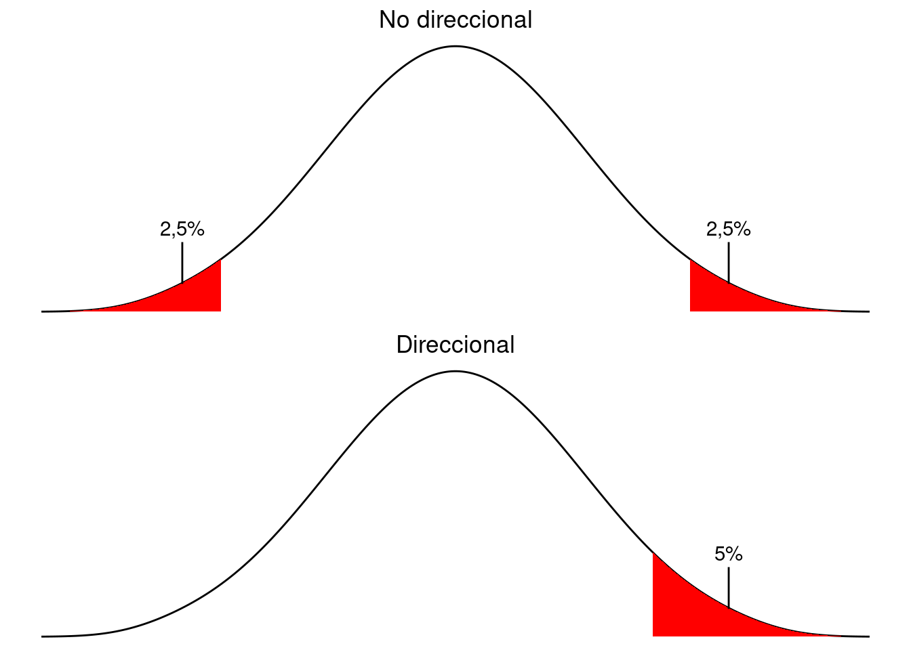

---
output:
  pdf_document: default
  html_document: default
---
# Diseño de proyectos y test de hipotesis

 

> Our knowledge can only be finite, while our ignorance must necessarily be infinite.
>
> ---Karl Popper

## El método científico

El filósofo de ciencias *Karl Popper* es considerado por muchos como el padre de la teoría científica moderna. Sostiene que la ciencia avanza proponiendo teorías e ideas que sean empíricamente refutables. Cuando una teoría es refutada por investigaciones empíricas surgen otras teorías que toman en cuenta las refutaciones de las anteriores y son sometidos al mismo proceso. Este tipo de pensamiento se conoce también como pensamiento «deductivo» y es fundamental para las ciencias empíricas. Deductivo, en este caso es contrario a «inductivo» toma como *confirmatorias* toda observación que sostiene una teoría, sea esta falseable o no.

Por ejemplo, podemos proponer la teoría de que «en la Ciudad de Buenos Aires nunca cae nieve». Durante la segunda mitad del siglo pasado podíamos corroborar nuestra teoría día tras día al medir el nivel de nieve --que era cero--, pero bastó con una sola nevada, que ocurrió el nueve de julio del 2007, para que nuestra teoría quedara refutada.

Para que una teoría sea científica tiene que ser posible demostrar su falsedad empíricamente, es decir tenemos que poder obtener datos, por experimentos u observaciones, capazes de comprobar que la teoría no es correcta. Esto se llama el principio de falsabilidad,^[posiblemente por su cognado en ingles:«falsifiabilidy»] falsación o refutabilidad. 

Nuestra teoría de la falta de nieve en la ciudad de Buenos Aires es científica, ya la podemos hacer medidas para refutarla. El hecho de que la teoría resultó incorrecta no implica que no sea científica. 

Cabe mencionar que existen ciencias: las ciencias «formales» como las matemáticas, la lógica formal etcétera; cuyas teorías no dependen de observación empírica ya que se concentran en el estudio abstracto de cantidades, estructuras y cambio. 

## El diseño de una investigación

### Estudios experimentales y observacionales {-}

Podemos distinguir entre dos tipos de investigación científica en las ciencias empíricas. 
Los estudios *experimentales* son estudios donde nosotros manipulamos alguna variable para darnos cuenta qué efecto tiene. En nuestro ejemplo de dos cursos con metodologías distintas, nosotros hemos manipulado la variable *metodología*. Como hemos mencionado antes en la sección \@ref(variables-y-su-clasificacion) esta es la variable *independiente*. Los estudios experimentales son muy frecuentes en las ciencias naturales y también se aplican a las ciencias humanas. 

En las ciencias humanas, sin embargo, a menudo nos encontramos con datos en los que no podemos manipular la variable independiente. En el caso de los datos lingüísticos de la figura \@ref(fig:persuasion-poligon-i), no podemos *cambiar* el largo de las palabras. Nos tenemos que limitar a recoger los datos e intentar discernir alguna relación entre ellas. Igual tenemos una variable dependiente «largo de palabra» y una independiente «frecuencia», solo que no controlamos la variable independiente. Este tipo de estudios son *observacionales* y a veces se habla de estudios *correlacionales*.

### Fuentes de ruido en los datos {-}

Cuando estamos haciendo un estudio experimental controlamos no solo la variable independiente, sino también podemos diseñar el experimento para minimizar el efecto de otras variables que puedan influir en la variable dependiente. La meta es de minimizar los efectos provinientes de de factores que no son relevantes para nuestro estudio a fin de poder afirmar con más confianza que los efectos observados en realidad tienen que ver con la variable independiente. En el caso de los dos grupos con metodologías distintos podemos, por ejemplo, asegurarnos de que los dos cursos tengan el mismo profesor, se dicte en horarios similares y que los de estudiantes que reciben el curso tengan características similares en cuanto a edad, género, promedio de notas en otras materias etcétera. En el caso de un estudio observacional no tenemos este nivel de control, lo que sí podemos hacer es intentar estimar el efecto de interferencia de otras variables y tomarlo en cuenta en nuestros análisis. 

Incluso en el caso de un estudio experimental, no es realista esperar que podemos remover totalmente el efecto de variables irrelevantes. A lo que podemos aspirar y debemos intentar, sin embargo, es de remover la mayor cantidad posible de *variación sistemática*. Si en el caso del las notas de los grupos de estudiantes pusimos todos los hombres en un grupo y todas las mujeres en otro, no podemos saber si la diferencia que observamos se debe la diferencia de metodología didáctica o si es una diferencia de género. Por ello es preciso hacer lo posible para que las variables que son irrelevantes para nuestra investigación operen de manera aleatoria en nuestras muestras y, de ser posible, minimizar su efecto. Si no operan de manera aleatoria corremos el riesgo de en realidad medir otra variable --género en lugar de metodología-- de la que queremos investigar, y si su efecto genera mucha varianza va a bajar la confianza que podemos tener el las conclusiones obtenidas.  

## Tests de hipótesis

Vimos en la sección \@ref(el-error-estandar-y-su-interpretacion) que podemos estimar los valores de la población en base a muestras y que podemos calcular un margen de error y niveles de confianza de estas estimaciones. Podemos valernos de los mismos conceptos para concluir algo sobre la relación entre variables: independiente y dependiente por ejemplo.

### Tests estadísticos de significanza

En el caso de nuestros dos grupos de estudiantes (véase: \@ref(cual-usar)) ya vimos que existe una diferencia entre los dos grupos en la media de la nota obtenida. De la figura \@ref(fig:poligono-de-frecuencias-notas-comparativo) vimos que igual las dos distribuciones de solapan en gran medida. Por tanto no podemos afirmar con absoluta certeza que las diferencias observadas son el efecto de la metodología pedagógica aplicada o si son producto de la inherente variabilidad de las muestras. 

El objetivo de un test estadístico de significanza es determinar si las diferencias observadas el resultado de variación aleatoria o si pueden razonablemente ser atribuidos a la variable independiente.   

### La hipótesis nula y alternativa

Para testear una hipótesis el primer paso es establecer una *hipotesis nula*. Esta hipótesis afirma que *no existe el efecto* que estamos investigando. Siguiendo los lineamientos del método cientifico, ahora nuestra labor es, a través de mediciones u observaciones, *refutar* esta hipótesis, con lo cual podemos proponer otra, llamada *hipótesis alternativa*. Una *hipótesis nula* se formula como una afirmación precisa y empiricamente refutable. En el ejemplo de los dos grupos de estudiantes la hipotesis nula  podría expresarse como: «No existe diferencia entre la media de notas entre los dos grupos».

También debemos formular una o dos hipotesis alternativas. Si formulamos dos,  una va a afirmar que la media de notas del grupo A es superior a la del grupo B y la otra que la media de notas del grupo B es mayor a la media de notas del grupo A. Si usamos una sola hipótesis alternativa esta simplemente plantea que la media notas de los dos grupos es desigual.

> #### Notación formal {-}
> 
>En notación formal, muy frecuente en textos académicos, se usa la letra *H* (mayuscula) para significar una hipótesis y tiene subindice «0» o «null». Las hipótesis alternativas reciben subindice numérica (1 y 2 etcétera). En el caso descrito en la sección anterior se podría expresar así:
>
>$H_0: \text{No hay diferencia entre los grupos}$
>
>$H_1: \text{Hay diferencia}$
>
>o, includo más formal: 
>
>$H_0: \mu_A=\mu_B$
>
$H_1: \mu_A\neq\mu_B$.

La estrategia del test de hipótesis acumular evidencia empírica que nos permita *refutar* la hipótesis nula y no intentar fomentar cualquiera de las alternativas directamente. Lo que temenos que hacer es aplicar un test estadístico y calcular la probabilidad de obtener las observaciones que hemos obtenido y si esa probabilidad es muy baja, refutamos $H_0$ a favor de una de las alternativas. 

Es preciso aclarar que nunca podemos estar absolutamente seguros de estar justificados en refutar $H_0$. Siempre existe la posibilidad de que las diferencias observadas de deban a la aleatoriedad de las muestras. Lo que sí podemos mostrar es que la probabilidad de que así sea es muy baja.  

### Niveles de significanza

Dado que siempre existe la posibilidad de refutar injustificadamente nuestra $H_0$, tenemos que determinar un nivel debajo del cual estamos dispuestos a equivocarnos en nuestra afirmación. Este se llama el *nivel de significanza*, también se describe con la letra griega $\alpha$ y se llama nivel-$\alpha$ (nivel alfa). El nivel de significanza está coneptual y matemáticamente ligado con los [intervalos de confianza] que vimos en el capítulo \@ref(estimacion-de-parametros). 

Si estamos dispuestos a rechazar $H_0$ si la  probabilidad (p) de hacerlo injustificadamente es igual o menor a 0,05, eligimos un nivel de significanza de 0,05, también llamado «nivel de 5%». Su notación a menudo se encuentra como: $p\leqslant0,05$. Este nivel es bastante común en las ciencias humanas, en cambio en otras disciplinas de las ciencias exactas y médicas por ejemplo, a veces se opera con $p\leqslant0,01$ o $p\leqslant0,001$, lo que significa que se acepta rechazar injustificadamente $H_0$ una vez en cien o una vez en mil respectivamente. 

Para cada test estadístico y cada nivel de significanza eligido existirá un valor crítico o un *rango crítico* dentro del cual el valor del cálculo estadístico tiene que encontrarse para que las diferencias observadas en las muestras se consideren estadísticamente significativos. Si el valor del test estadístico no cae en ese rango no podemos rechazar $H_0$ sobre la base este conjunto específico de observaciones, pero es posible que debamos repetir el estudio con muestras más grandes. 

### Tipos de error 

Cuando tomamos la decisión de rechazar o aceptar la hipótesis nula hay dos errores que podemos cometer. Podemos rechazar $H_0$ cuando $H_0$ es correcta, o podemos aceptar $H_0$, cuando es falsa. En el primer caso estamos hablando de un *error de tipo I*, también denominado *error de tipo $\alpha$* o *falso positivo*. En el segundo caso hablamos de un *error de tipo II*, *error de tipo $\beta$* (beta) o falso negativo. 

### Tests direcionales y no direcionales

En la sección \@ref(la-hipotesis-nula-y-alternativa) propusimos una hipótesis nula y su alternativa:

\BeginKnitrBlock{example}\iffalse{-91-72-105-112-111-116-101-115-105-115-32-110-117-108-97-32-121-32-117-110-97-32-97-108-116-101-114-110-97-116-105-118-97-93-}\fi{}
<strong>(\#exm:non-directional-hypotheses)  \iffalse (Hipotesis nula y una alternativa) \fi{} </strong>

$H_0: \mu_A=\mu_B$
  
$H_1: \mu_A\neq\mu_B$.

\EndKnitrBlock{example}

$H_1$ se leería: «la media de A es desigual a la media de B». Este ejemplo \@ref(exm:non-directional-hypotheses) es de una predición *no direcional*. Es decir que no hemos tomado una posición a priori sobre si esperamos que las diferencias que observemos sean positivos o negativos.

A veces tenemos razones bien fundadas en creer que las diferencias, si las observamos, van a darse en una direción u otra. Si por ejemplo estamos midiendo la estaturas de muestras aleatorias de argentinas y argentinos podemos suponer de antemano que los hombres van a ser más altos que las mujeres ya que está comprobado que es así en otros países, hay razones biológicas etcétera. En ese caso podríamos formular una predicción direccional, lo cual significa que nuestra hipótesis alternativa es una sola y va en una dirección específica:

\BeginKnitrBlock{example}\iffalse{-91-72-105-112-111-116-101-115-105-115-32-110-117-108-97-32-121-32-117-110-97-32-97-108-116-101-114-110-97-116-105-118-97-32-100-105-114-101-99-99-105-111-110-97-108-93-}\fi{}
<strong>(\#exm:directional-two)  \iffalse (Hipotesis nula y una alternativa direccional) \fi{} </strong>

$H_0: \mu_M=\mu_F$
  
$H_1: \mu_M > \mu_F$.

\EndKnitrBlock{example}

La diferencia entre usar un test direccional o no direccional influye en los valores críticos de los diferentes tests. Si usamos un test direccional --y está justificado su uso, claro-- disminuye el riesgo de cometer un error de tipo II.  Está ilustrado en la figura \@ref(fig:non-directional-and-directional-normal-curves): para un test no-direcional necesitamos un 2,5% *en cada extremo* de la curva para que sume 5%, en el test direccional «gastamos» todo el lado positivo.  

(\#fig:non-directional-and-directional-normal-curves)Test no direccionales y test direccionales

\BeginKnitrBlock{example}\iffalse{-91-191-99-97-114-97-32-111-32-99-114-117-122-63-93-}\fi{}
<strong>(\#exm:unnamed-chunk-1)  \iffalse (¿cara o cruz?) \fi{} </strong>
\EndKnitrBlock{example}
Para desarrollar un poco más el concepto de test de hipótesis vamos a imaginarnos que estamos jugando a *cara o cruz*. Si tiramos una moneda hay un 50 y 50 de que salga cruz o cara. Tiramos la moneda y sale cara. La tiramos dos veces y sale dos veces cara. Tres veces -- tres caras... y seguimos perdiendo. 

¿En qué momento empezamos a sospechar que la moneda tiene dos caras?

Aún sin conocimientos matemáticos o de la teoría de la probabilidad empieza a obrar nuestra intuición --basada en nuestra experiencia que por su naturaleza es empírica.

Podemos formalizar el problema de la siguiente manera:

$H_0$: La moneda es honesta

$H_1$: La moneda tiene dos caras.

Podemos también calcular las probabilidades de lo que está pasando. La probabilidad de que  salga cara es 0,5 (50%) y de que salga cara dos veces es, por tanto, $0,5\times0,5=0,25$. Podemos calcular las probabilidades de varios casos más:

3 caras: $0,5\times0,5\times0,5=0,125$

4 caras: $0,5\times0,5\times0,\times0,55=0,0625$

5 caras: $0,5\times0,5\times0,\times0,55=0,03125$,

y vemos que si sale cara cinco veces de cinco ya podemos rechazar nuestra $H_0$ con un nivel de significanza de 0,05 ($p\leqslant0,05$).

### ¿Qué test usar?

En los capítulos que siguen vamos a desarrollar algunos tests de significanza estadística: el test de z, el test de t de Student, Mann-Whitney U, $\chi^2$, Wilcoxon y sign-test. La elección de cuál de ellos usar en un caso específico dependerá de:

1. Escala de medición de las variables
2. Las características de su distribución
3. Si las muestras son correlacionadas o no,

y los iremos detallando en cada caso.

### Procedimiento

El diseño de una investigación cuantitativa se puede resumir en estos cuatro pasos:

1. Formular hipotesis nula y alternativa(s)
2. Decidir el nivel de significanza estadística
3. Eligir un test estadístico a utilizarse
4. Aplicar la estadística y decidir si rechazamos $H_0$ o no. 

## Glosario

Error tipo I 
:    El error de rechazar $H_0$ cuando esta es correcta. 
    Equivalente en inglés: «Type I error». 

Error tipo II 
:    El error de no rechazar $H_0$ cuando esta es incorrecta. 
    Equivalente en inglés: «Type II error». 

Falsabilidad 
:    El hecho de que sea posible refutar una hipótesis, por medio de métodos empíricos. 
    Equivalente en inglés: «Falsifiability». 

Hipotesis alternativa 
:    Hipótesis a la que recurrimos si logramos refutar $H_0$. 
    Fórmula: $H_1$ 
    Equivalente en inglés: «Alternative hypothesis.». 

Hipotesis núla 
:    La hipótesis que plantea que el patrón que estamos buscando *no existe*. A través de un estudio empírico intentaremos refutar esta hipótesis. 
    Fórmula: $H_0$ 
    Equivalente en inglés: «Null hypothesis ($H_0$)». 

Método científico 
:    Metodología basada en la observación, medición y experimentación; y la formulación, análisis y modificación de hipótesis. 
    Equivalente en inglés: «Scientific method». 

Nivel de significanza 
:    La probabilidad de rechazar $H_0$ cuando esta es correcta. 
    Fórmula: $\alpha$ 
    Equivalente en inglés: «Alpha-level». 

Test direccional 
:    Test estadístico en la que hypótesis alternativa de expresa en una dirección u otra. 
    Equivalente en inglés: «Directional test». 

Test no direccional 
:    Test estadístico en la que hypótesis alternativa de expresa sin dirección especificar dirección. 
    Equivalente en inglés: «Non-directional test». 

