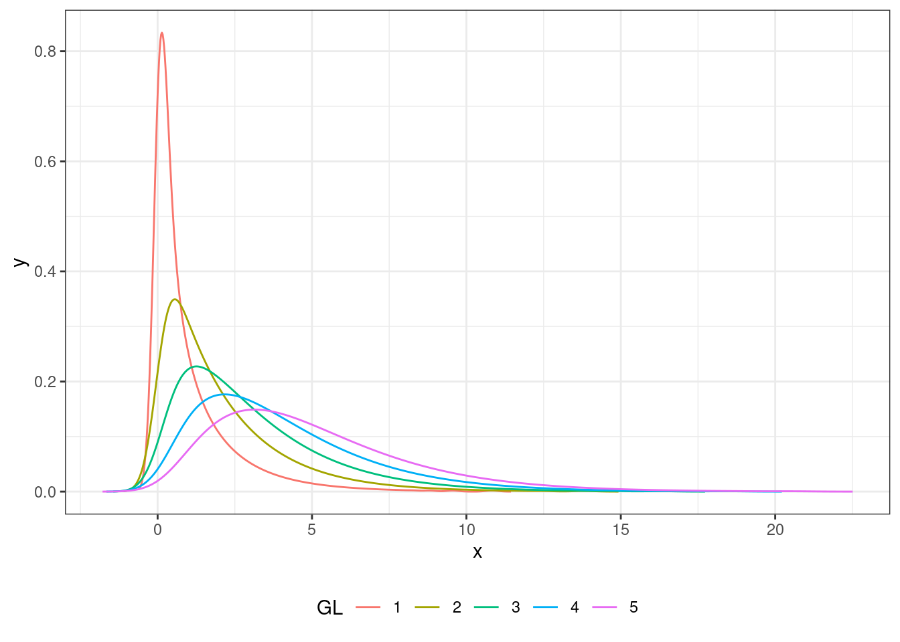

# Prueba de $\chi^2${#chi-square-test}

En los capítulos \@ref(pruebas-parametricas) y \@ref(pruebas-no-parametricas) vimos varios tests estadísticos que nos permiten apreciar la significanza de diferencias entre dos conjuntos de medidas cuantitativas. Las variables que vimos se medían en escala de razón, intervalo u ordinal. En este capítulo vamos a explorar algunas técnicas que nos permiten trabajar con variables que no se pueden medir en términos numéricos, sino que son de tipo «sí-o-no»; es decir que son de escala nominal. 

En particular vamos a explorar la distribuciónd de $\chi^2$ de Pearson. $\chi$ es una letra griega que suele pronunciarse «ji» (/xi/) y «chi» (/tʃiː)/^[del inglés donde se escribe «chi» y se pronuncia /kaɪ/].

<div class="figure">

<p class="caption">(\#fig:chi-square-plot)Distribución «ji cuadrado» con diferentes grados de libertad. </p>
</div>

## Características

El test de $\chi^2$ nos permite comparar las frecuencias que observamos con las frecuencias que esperaríamos en base a un modelo teórico o una hipótesis sobre la distribución de la variable en cuestión. Por cada par de valores observados y esperados calculamos la diferencia y aplicamos la fórmula de la definición \@ref(def:chi-squared).

\BeginKnitrBlock{definition}\iffalse{-91-36-92-99-104-105-94-50-36-93-}\fi{}<div class="definition"><span class="definition" id="def:chi-squared"><strong>(\#def:chi-squared)  \iffalse ($\chi^2$) \fi{} </strong></span>
$$
\chi^2 = \sum{(O-E)^2\over{E}}
$$
donde: 
  
* O: la frecuencia observada
* E: la frecuencia esperada 
</div>\EndKnitrBlock{definition}

Es importante tener en cuenta que $\chi^2$ se calcula usando las *frecuencias* y no las proporciones. 

La hipótesis nula es que no existe diferencia entre los valores observamos y los valores esperados. La alternativa es que hay tal diferencia. La forma de la distribución $\chi^2$, al igual que la de t, depende de los [grados de liberdad](#degrees-of-freedom) que desarrollaremos más adelante. 

## Prueba de independencia o asociación

Un uso muy frecuente de la prueba de $\chi^2$ es la de probar si dos características son independientes o tienen una asociación de manera que las frecuencias elevadas en una de ellas suele ser acompañado con frecuencias altas en la otra. 

Digamos que estamos haciendo una encuesta de opinión y preguntamos a 1230 argentinas y a 961 argentinos si están a favor o en contra de la ley del aborto o no. Queremos saber si en género de la persona está asociado con esa opinión. Entonces nuestros datos se pueden desplegar en una tabla 2 por 2.


|        | A favor| En contra|
|:-------|-------:|---------:|
|Mujeres |     762|       468|
|Hombres |     484|       477|

La hipótesis nula es que no hay asociación entre las dos variables, es decir que el género de la persona no se asocia con su opinión política sobre este tema. Para calcular los valores esperados tenemos que calcular las sumas de las filas y las columnas y además el total de ellos. 


Table: (\#tab:opiniones-aborto-ii)Opiniones sobre la ley del aborto.

|        | A favor| En contra| total|
|:-------|-------:|---------:|-----:|
|Mujeres |     762|       468|  1230|
|Hombres |     484|       477|   961|
|total   |    1246|       945|  2191|

El valor esperado es la cantidad de las observaciones que caen en cada celda si las distribuimos proporcionalmente. Esto se calcula multiplicando las sumas de la fila y columna de la celda respectiva y dividir por el total de las observaciones. Por ejemplo, el valor esperado de mujeres a favor sería:
$$
E = {{1230\times1246}\over2191} = 699,48
$$

Si calculamos esto para todas las celdas obtenemos:


Table: (\#tab:opiniones-aborto-iii)Valores esperados: opiniones sobre la ley del aborto.

|        | A favor| En contra| total|
|:-------|-------:|---------:|-----:|
|Mujeres |  699,49|    530,51|  1230|
|Hombres |  546,51|    414,49|   961|
|total   | 1246,00|    945,00|  2191|

y con esto podemos calcular las diferencias.


Table: (\#tab:opiniones-aborto-iiii)Diferencias entre valores observados y esperados.

|        | A favor| En contra|
|:-------|-------:|---------:|
|Mujeres |   62,51|    -62,51|
|Hombres |  -62,51|     62,51|

y podemos aplicar la fórmula en \@ref(def:chi-squared):

$$
\chi^2 = \sum{(O-E)^2\over{E}} = {62,52^2\over699,49} +{-62,52^2\over530,51} +{62,52^2\over546,51}+{-62,52^2\over414,49} = 29,53.
$$

Podemos comparar este valor con los de la tabla en el [apendice C](#chi-square-disrtibution) para un grado de libertad. Vemos que rechazamos $H_0$ y concluimos que el género sí influye en la opinión sobre este tema. 

### Grados de libertad{#degrees-of-freedom}

A lo largo de este texto se ha mencionado en algunas ocasiones el término *grados de libertad* y hasta ahora no ha sido demasiado complejo calcularlo restando uno del número de observaciones. El concepto de grado de libertad se puede entender si consideramos la tabla \@ref(tab:opiniones-aborto-ii) en la que tenemos una tabla de contingencia $2\times2$. Calculamos en ese caso las frecuencias marginales que están el la columna *suma*. Imaginemos que tenemos la misma tabla con las frecuencias marginales pero con una sola de las frecuencias observadas. Así lo hemos hecho en la tabla \@ref(tab:degrees-of-freedom)

Table: (\#tab:degrees-of-freedom)Tabla de contingencia con un solo valor.

|        | A favor| En contra| total|
|:-------|-------:|---------:|-----:|
|Mujeres |     762|         -|  1230|
|Hombres |       -|         -|   961|
|total   |    1246|       945|  2191|

Con este único valor podemos rellenar las demás celdas, ya que su contenido está dato por la diferencia entre ese valor y los totales marginales. Esto quiere decir que en esta tabla hay un solo valor que se pueda asignar arbitrariamente, el resto está dado por este valor. Por ello decimos que tenemos un solo grado de libertad.

En capítulos anteriores hemos visto que los grados de libertad a menudo son N-1. Podemos usar un ejemplo sencillo para demostrar por qué tiene que ser así. Si hacemos un conjunto de tres números y queremos que la suma sea diez, podemos asignar cualquier número en las primeras dos posiciones, pero cuando vamos a asignar el tercero ya no tenemos libertad de eligir. Entonces tenemos dos grados de libertad.

Para una tabla de contingencia la fórmula general para calcular los grados de libertad es: $(c-1)\times(f-1)$ es decir número de columnas menos uno por número de filas menos uno. Si la tabla es de $3\times3$, tendríamos 4 grados de libertad.

\BeginKnitrBlock{example}\iffalse{-91-80-114-117-101-98-97-32-100-101-32-36-92-99-104-105-94-50-36-32-101-110-32-82-93-}\fi{}<div class="example"><span class="example" id="exm:unnamed-chunk-1"><strong>(\#exm:unnamed-chunk-1)  \iffalse (Prueba de $\chi^2$ en R) \fi{} </strong></span></div>\EndKnitrBlock{example}
En este ejemplo vamos a realizar la misma prueba de $\chi^2$ que fuimos desarrollando en las secciones anteriores. Podemos usar la función de R ```chisq.test``` para realizarla. Toma como argumento una *matriz* de datos de las frecuencias.


```r
M <- as.table(
  rbind(c(762, 468), 
        c(484, 477))
  )
# Damos nombre a las columnas y las filas 
colnames(M) <- c("A favor","En contra")
rownames(M) <- c("Mujeres","Hombres")

# Verificamos el ingreso de datos
M
```

```
#>         A favor En contra
#> Mujeres     762       468
#> Hombres     484       477
```

Como se puede observar, la sintaxis de R no es del todo intuitiva, por lo que siempre conviene verificar que tenemos los números y nombres correctos antes de proceder con el test.

```r
# Realizamos test de ji-cuadrado
chisq.test(M)
```

```
#> 
#> 	Pearson's Chi-squared test with Yates' continuity
#> 	correction
#> 
#> data:  M
#> X-squared = 29.06, df = 1, p-value = 7.019e-08
```

El valor de *p* es tan bajo que R lo devuelve en *notación científica*. La parte *e-08* quiere decir que el número es: 0,000000007019, es decir que hay *ocho* ceros antes de los dígitos significativos. 

También vemos que el valor de $\chi^2$ que calculó R es distinto al que calculamos a mano, aunque sea por unas décimas. Esto se debe a que por defecto R hace una *corrección de Yates*. Yates descubrió que para una tabla de contingencia $2\times2$ hay un sesgo positivo y propuso una técnica para contrarrestar el sesgo. Si queremos usar la formula original, y la que usamos para nuestro cálculo a mano podemos agregar el parámetro ```correct = FALSE``` a la función así:


```r
chisq.test(M, correct = FALSE)
```

```
#> 
#> 	Pearson's Chi-squared test
#> 
#> data:  M
#> X-squared = 29.53, df = 1, p-value = 5.506e-08
```

y vemos que R coincide con nuestros cálculos.


## Glosario

Grados de libertad 
:    Número de valores que se pueda asignar arbitrariamente a un conjunto manteniendo estable sus propiedades. 
    Equivalente en inglés: «Degrees of freedom». 

Prueba de $\chi^2$ «ji cuadrado» 
:    Prueba estadística que nos permite apreciar si dos variables nominales están asociadas. 
    Fórmula: $\chi^2 = \sum{(O-E)^2\over{E}}$ 
    Equivalente en inglés: «Chi-square test». 
