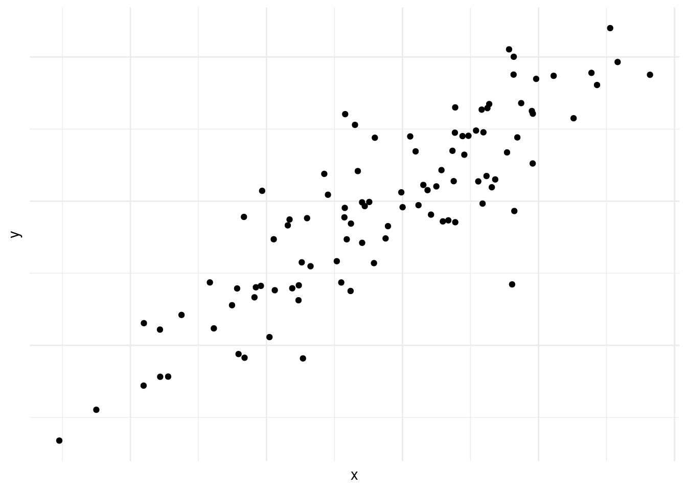
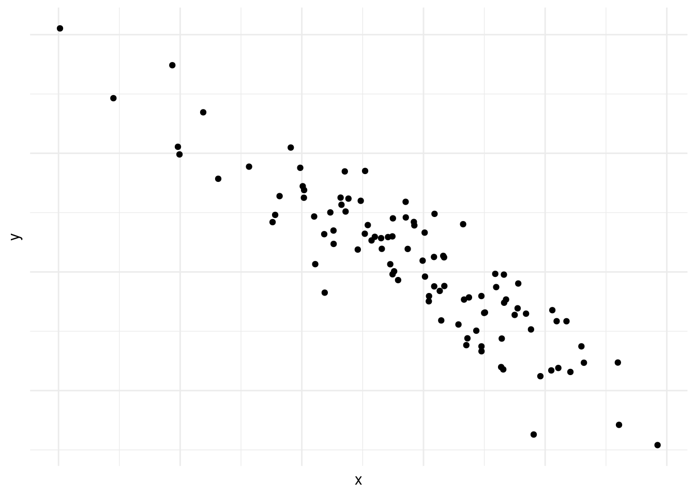
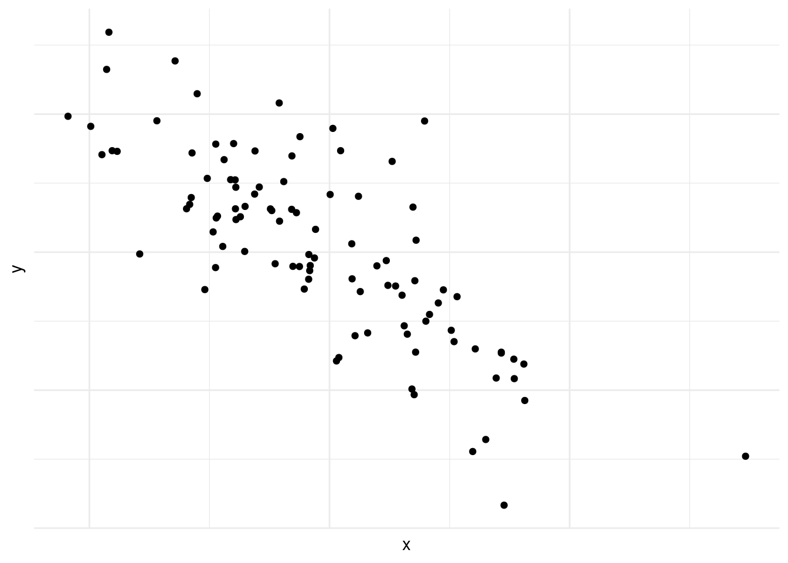
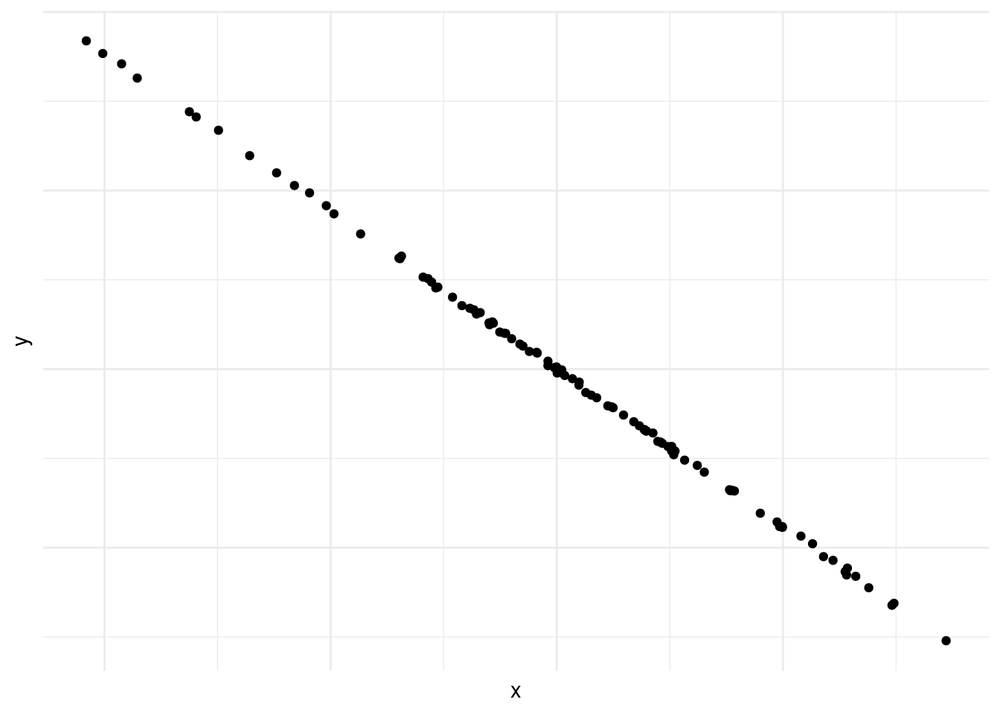
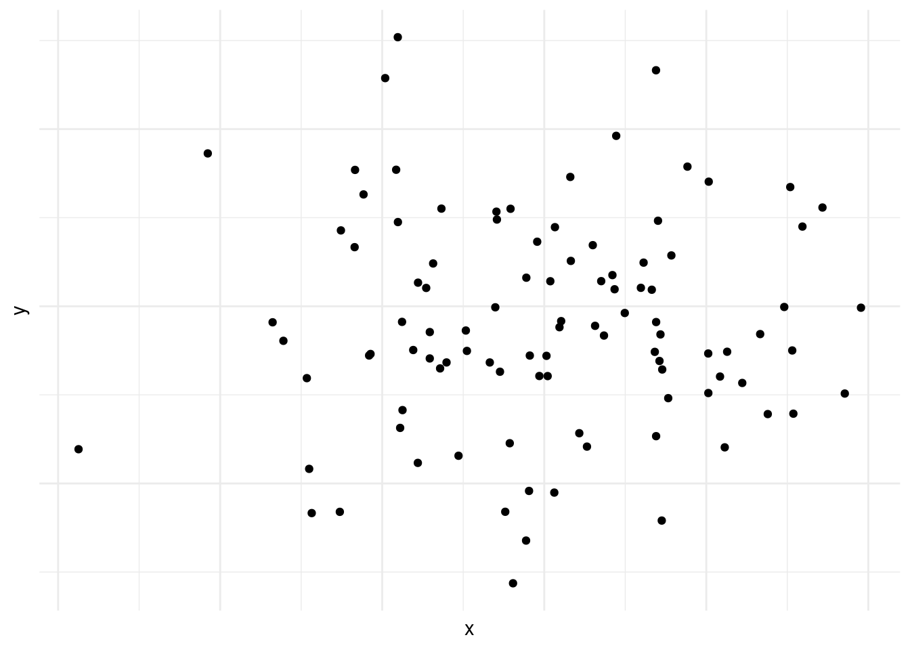
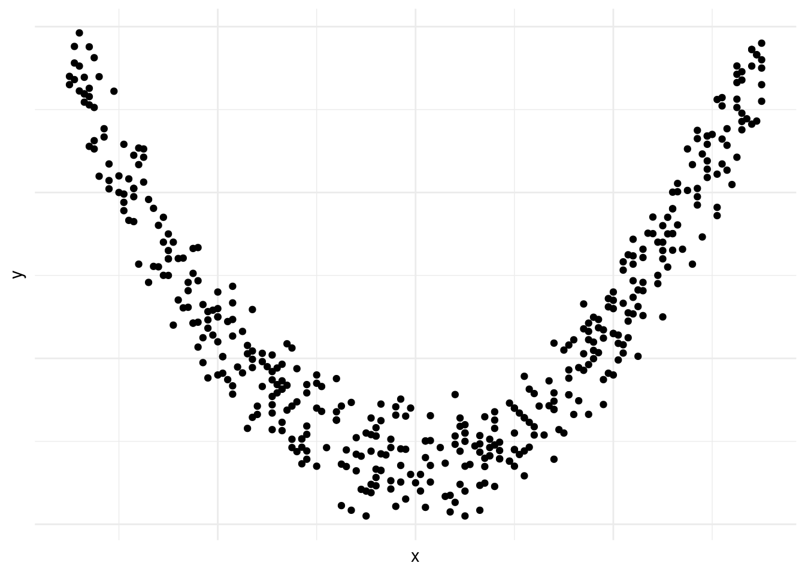
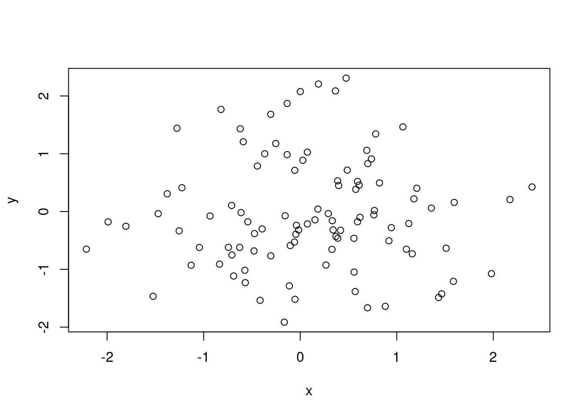
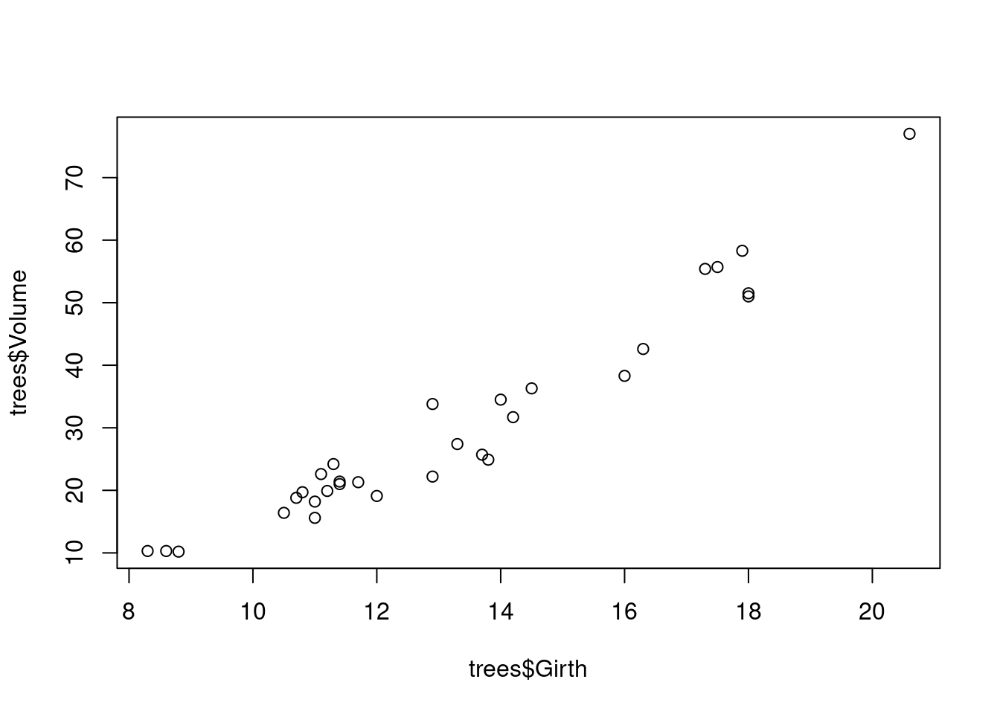
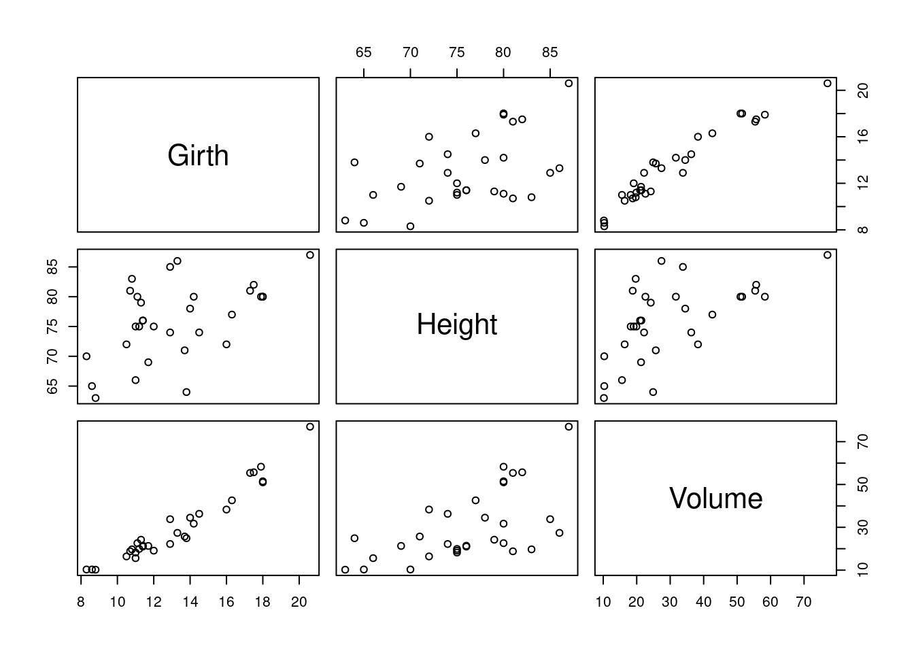
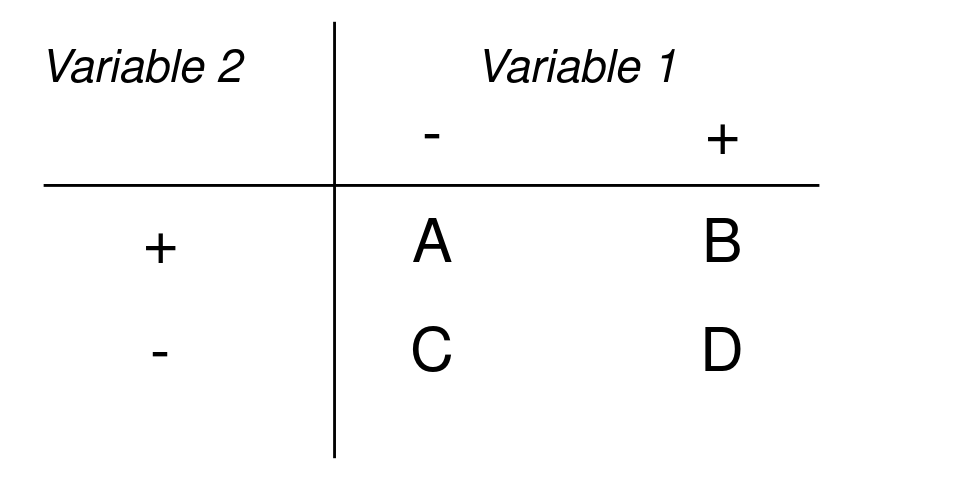

# Correlación


La correlación es el área de las estadísticas que estudia la relación sistemática entre dos o más variables e intenta contestar a preguntas como: ¿Si sube A va a subir B también? En este capítulo desarrollaremos algunas técnicas para contestar este tipo de pregunta. 

## Visualización

El primer paso para estudiar posibles relaciones entre variables es visualizarlos. Si tenemos dos variables medidas por cada miembro de la población o muestra que estamos investigando podemos generar un *diagrama de disperción* también conocido como *scatterplot*. En este tipo de visualización cada miembro de la muestra/población está representado por un punto, y las coordinadas del punto corresponde a las dos variables que hemos medido, en el eje horizontal y vertical respectivamente. 

El las figura \@ref(fig:strong-positive-correlation), vemos que la concentración de puntos suben de la izquierda a la derecha. Es decir cuando avanzamos en el eje horizontal avanzamos en el eje vertical también. Es un ejemplo de una *correlación positiva*, como podría ser edad y estatura.  

<div class="figure">

<p class="caption">(\#fig:strong-positive-correlation)Correlación positiva</p>
</div>

En la figura \@ref(fig:strong-negative-correlation) vemos lo contrario, mientras avanzamos en el eje vertical retrocedemos (o bajamos) en el eje horizontal. Esto se conoce como *correlacion negativa*.

<div class="figure">

<p class="caption">(\#fig:strong-negative-correlation)Correlación negativa</p>
</div>

En la figura \@ref(fig:weak-negative-correlation), también vemos correlación negativa, pero es menos fuerte que en la figura \@ref(fig:strong-negative-correlation).

<div class="figure">

<p class="caption">(\#fig:weak-negative-correlation)Correlación negative leve</p>
</div>

En la figura \@ref(fig:near-perfect-negative-correlation) vemos una correlación negativa casi perfecta entre las dos variables.

<div class="figure">

<p class="caption">(\#fig:near-perfect-negative-correlation)Correlación casi perfecta</p>
</div>

En la figura \@ref(fig:no-correlation) vemos un caso de correlación inexistente entre las variables en cuestión. 

<div class="figure">

<p class="caption">(\#fig:no-correlation)Correlación nula</p>
</div>

En la figura \@ref(fig:non-linear-relationship) vemos que existe una relación entre las dos variables, pero que esta no es lineal.^[De hecho es cuadrática: $y~\sim~x^2$.] 

<div class="figure">

<p class="caption">(\#fig:non-linear-relationship)Relación no lineal</p>
</div>

Las figuras \@ref(fig:strong-positive-correlation),
\@ref(fig:strong-negative-correlation),
\@ref(fig:weak-negative-correlation), 
\@ref(fig:near-perfect-negative-correlation),
\@ref(fig:no-correlation) y 
\@ref(fig:non-linear-relationship) 
demuestran por qué es preciso graficar los datos al inicio del análisis. Nos da una indicación de si existe una correlación o no, si es positiva o negativa y que tan fuerte es. 
También nos podemos darnos cuenta de patrones en los datos que no son lineales, como es el caso de los datos en la figura \@ref(fig:non-linear-relationship). Asimismo, a veces nos  encontramos con una correlación como la que vemos en la figura \@ref(fig:near-perfect-negative-correlation). Las correlaciones que son demasiado perfectas suelen ser un signo de advertencia y  podemos preguntarnos si en realidad son dos variables distintas o si las dos están midiendo lo mismo.


\BeginKnitrBlock{example}\iffalse{-91-71-101-110-101-114-97-114-32-100-105-97-103-114-97-109-97-32-100-101-32-100-105-115-112-101-114-115-105-243-110-32-101-110-32-82-93-}\fi{}<div class="example"><span class="example" id="exm:example-scatterplot-i"><strong>(\#exm:example-scatterplot-i)  \iffalse (Generar diagrama de dispersión en R) \fi{} </strong></span></div>\EndKnitrBlock{example}


```r
# Generamos datos
datos = data.frame(
  x=rnorm(100),
  y=rnorm(100)
)

# Graficamos
plot(datos)
```



En el ejemplo \@ref(exm:example-scatterplot-i) utilizamos la función ```rnorm``` para generar cien observaciones aleatorias con distribución normal y los ponemos dentro de un ```data.frame```. Luego usamos la función ```plot``` para graficarlos. Como nuestro ```data.frame``` tiene solo dos columnas R entiende que estos son los datos que queremos graficar. Si el ```data.frame``` tiene más columnas, podemos especificar los que queremos graficar así:


```r
plot(datos$x,datos$y)
```

\BeginKnitrBlock{example}\iffalse{-91-71-101-110-101-114-97-114-32-100-105-97-103-114-97-109-97-32-100-101-32-100-105-115-112-101-114-115-105-243-110-32-101-110-32-82-93-}\fi{}<div class="example"><span class="example" id="exm:example-scatterplot-ii"><strong>(\#exm:example-scatterplot-ii)  \iffalse (Generar diagrama de dispersión en R) \fi{} </strong></span></div>\EndKnitrBlock{example}

Por defecto R viene con algunos data.frames ya cargados, uno de ellos es «trees», podemos usar la función ```head``` para ver las primeras seis filas.


```r
head(trees)
```

```
#>   Girth Height Volume
#> 1   8.3     70   10.3
#> 2   8.6     65   10.3
#> 3   8.8     63   10.2
#> 4  10.5     72   16.4
#> 5  10.7     81   18.8
#> 6  10.8     83   19.7
```

Vemos que tiene tres columnas «Girth», «Height» y «Volume» (circumferencia, alto y volumen), los que, por lógica, deben tener alta correlación. Graficamos dos de ellos.

```r
plot(trees$Girth, trees$Volume)
```



Si usamos la función ```plot``` sin especificar columnas R entiende que queremos ver todas las combinaciones.

```r
plot(trees)
```



Este tipo de visualización puede ser útil cuando tenemos algunas variables y queremos darnos cuenta qué correlaciones hay. La visualización funciona bien hasta cierto número de columnas --ocho más o menos--, luego se vuelve difícil de leer y por ende de interpretar.  

## Coeficientes de correlación

Para tener una medida cuantitativa precisa de la correlación entre las variables calculamos un coeficiente de correlación. A continuación vamos a tres de ellos, el de Pearson, el de Spearman y el coeficiente $\phi$ (de la letra griega que corresponde a *f* en minúscula -- se pronuncia «fi». Los coeficientes de correlación se expresan por un número con varios decimales entre -1 y 1, donde -1 y 1 indican correlaciones perfectas, negativas y positivas respectivamente y 0 indica correlación nula.

El coeficiente Pearson es adecuado para datos de escala de razón o intervalo, el de Spearman para datos de escala ordinal y el coeficiente $\phi$ se usa para datos nominales. 

### Coeficiente Pearson

Como ya mencionamos, el coeficiente de Pearson es apropiado cuando las variables a comparar con de escala de intervalo o razón ya que toma en cuenta la magnitud relativa de las observaciones. 

Si tenemos un conjunto de pares de observaciones podemos representar el primer elemento del par por *x* y el segundo por *y*. Entonces el conjunto de los x van a tener una desviación estándar se calcula según la definición \@ref(def:definition-standard-deviation), así:
$$
s_x = {\sqrt{(\sum(x-\bar{x})^2\over{N-1}}}.
$$

De la misma manera *y* tiene su desviación estándar:
$$
s_y = {\sqrt{(\sum(y-\bar{y})^2\over{N-1}}}.
$$

Ahora podemos normalizar las variables según \@ref(def:definition-z-score) asi:

$$
z_x = {x-\bar{x}\over{s_x}},
$$

$$
z_y = {y-\bar{y}\over{s_y}}.
$$

Y con estos datos podemos calcular el coeficiente según la definición \@ref(def:definition-pearson-correlation).

\BeginKnitrBlock{definition}\iffalse{-91-67-111-101-102-105-99-105-101-110-116-101-32-100-101-32-99-111-114-114-101-108-97-99-105-243-110-32-100-101-32-80-101-97-114-115-111-110-93-}\fi{}<div class="definition"><span class="definition" id="def:definition-pearson-correlation"><strong>(\#def:definition-pearson-correlation)  \iffalse (Coeficiente de correlación de Pearson) \fi{} </strong></span></div>\EndKnitrBlock{definition}
$$
r={\sum{z_xz_y}\over{N-1}}
$$
donde:

* $\sum{z_xz_y}$: La suma de los productos^[«Producto» en matemática es el resultado de una operación de multiplicación. Si multiplicamos $2\times2=4$, 4 es el producto.] de las dos variables normalizadas. 

Existe otra definición es matemáticamente equivalente y que se usa a veces para hacer el cálculo a mano:

\BeginKnitrBlock{definition}\iffalse{-91-67-111-101-102-105-99-105-101-110-116-101-32-100-101-32-99-111-114-114-101-108-97-99-105-243-110-32-80-101-97-114-115-111-110-93-}\fi{}<div class="definition"><span class="definition" id="def:definition-pearson-correlation-ii"><strong>(\#def:definition-pearson-correlation-ii)  \iffalse (Coeficiente de correlación Pearson) \fi{} </strong></span></div>\EndKnitrBlock{definition}

$$
r={N\Sigma{xy}-\Sigma{x}\Sigma{y}\over{\sqrt{\{N\Sigma{x^2}-(\Sigma{x})^2\}\times\{N\Sigma{y^2}-(\Sigma{y})^2\} }}}
$$

\BeginKnitrBlock{example}\iffalse{-91-67-225-108-99-117-108-111-32-100-101-108-32-67-111-101-102-105-99-105-101-110-116-101-32-100-101-32-99-111-114-114-101-108-97-99-105-243-110-32-100-101-32-80-101-97-114-115-111-110-93-}\fi{}<div class="example"><span class="example" id="exm:pearson-coefficient-calculation"><strong>(\#exm:pearson-coefficient-calculation)  \iffalse (Cálculo del Coeficiente de correlación de Pearson) \fi{} </strong></span></div>\EndKnitrBlock{example}


En este ejemplo, adaptado de [@butler1985statistics], vamos a suponer que hemos tomado un examen de traducción y otro de comprensión de inglés a doce estudiantes. Los resultados de estos exámenes están en la tabla \@ref(tab:resultados-dos-examenes). 


Table: (\#tab:resultados-dos-examenes)Resultados de un examen de tradución (x) y de comprensión (y) de ingles.

|Estudiante |  x|  y|
|:----------|--:|--:|
|1          | 17| 15|
|2          | 13| 13|
|3          | 12|  8|
|4          | 14| 17|
|5          | 15| 16|
|6          |  8|  9|
|7          |  9| 14|
|8          | 13| 10|
|9          | 11| 16|
|10         | 14| 13|
|11         | 12| 14|
|12         | 16| 17|

Para poder aplicar la fórmula vamos a precisar los valores llevados al cuadrado, el producto de $x\times y$ y las sumas de las columnas. Calculándolos obtenemos los datos de la tabla \@ref(tab:resultados-dos-examenes-ii).


Table: (\#tab:resultados-dos-examenes-ii)Resultados de un examen de tradución (x) y de comprensión (y) de ingles.

|Estudiante |  x|  y|  x2|  y2|  xy|
|:----------|--:|--:|---:|---:|---:|
|1          | 17| 15| 289| 225| 255|
|2          | 13| 13| 169| 169| 169|
|3          | 12|  8| 144|  64|  96|
|4          | 14| 17| 196| 289| 238|
|5          | 15| 16| 225| 256| 240|
|6          |  8|  9|  64|  81|  72|
|7          |  9| 14|  81| 196| 126|
|8          | 13| 10| 169| 100| 130|
|9          | 11| 16| 121| 256| 176|
|10         | 14| 13| 196| 169| 182|
|11         | 12| 14| 144| 196| 168|
|12         | 16| 17| 256| 289| 272|


Sabemos que N=12, pero vamos a precisar las sumas de algunas columnas:

* $\Sigma{x}$ = 154
* $\Sigma{y}$ = 162
* $\Sigma{x^2}$ = 2054
* $\Sigma{y^2}$ = 2290
* $\Sigma{xy}$ = 2124.

Aplicamos la fórmula:


\begin{split}
&r= {N\Sigma{xy}-\Sigma{x}\Sigma{y}\over{\sqrt{\{N\Sigma{x^2}-(\Sigma{x})^2\}\times\{N\Sigma{y^2}-(\Sigma{y})^2\} }}} \\
&~~~~~~~\Updownarrow\\
&r={12\times2~124-154\times162\over{\sqrt{\{12\times2~054-154^2\}\times\{12\times2~290-162^2\} }}} \\
&~~~~~~~\Updownarrow\\

&r={25~488-24~948\over{\sqrt{\{24~648-23~716\}\times\{27~480-26~244\} }}} \\
&~~~~~~~\Updownarrow\\

&r= {540\over{\sqrt{932\times1236}}} \\
&~~~~~~~\Updownarrow\\
&r= {540\over{\sqrt{1~151~932}}} \\
&~~~~~~~\Updownarrow\\

&r= {540\over1~073,28} \\
&~~~~~~~\Updownarrow\\

&r= 0,5031

\end{split} 

\BeginKnitrBlock{example}\iffalse{-91-67-225-108-99-117-108-111-32-100-101-108-32-67-111-101-102-105-99-105-101-110-116-101-32-100-101-32-99-111-114-114-101-108-97-99-105-243-110-32-100-101-32-80-101-97-114-115-111-110-32-101-110-32-82-93-}\fi{}<div class="example"><span class="example" id="exm:pearson-coefficient-calculation"><strong>(\#exm:pearson-coefficient-calculation)  \iffalse (Cálculo del Coeficiente de correlación de Pearson en R) \fi{} </strong></span></div>\EndKnitrBlock{example}

Si no queremos hacer todos los cálculos del ejemplo \@ref(exm:pearson-coefficient-calculation) a mano podemos recurrir a R que con la función ```cor``` lo calcula. 


```r
# Cargamos datos
datos<- data.frame(
  Estudiante = c( 1, 2, 3, 4, 5, 6, 7, 8, 9, 10, 11, 12),
  x = c( 17, 13, 12, 14, 15, 8, 9, 13, 11, 14, 12, 16),
  y = c( 15, 13, 8, 17, 16, 9, 14, 10, 16, 13, 14, 17)
) 

# Llamamos función
cor(datos$x, datos$y)
```

```
#> [1] 0.5031258
```


### Coeficiente Spearman

Si una o ambas variables que estamos comparando son de escala ordinal, el coeficiente apropiado es el de Spearman. Para calcularlo ordenamos las observaciones de la primer variable de manera ascendiente y les damos el valor de su orden. Si dos observaciones de la misma variable tienen el mismo valor, si hay empates, se saca el promedio cual si el empate no hubiera existido. Hacemos lo mismo para la segunda variable. Calculamos la diferencia entre los rangos para cada par de observaciones. La correlación Spearman o $\rho$ de la letra griega *r* se calcula según la definición \@ref(def:definition-spearman-correlation).

\BeginKnitrBlock{definition}\iffalse{-91-67-111-101-102-105-99-105-101-110-116-101-32-100-101-32-99-111-114-114-101-108-97-99-105-243-110-32-100-101-32-83-112-101-97-114-109-97-110-93-}\fi{}<div class="definition"><span class="definition" id="def:definition-spearman-correlation"><strong>(\#def:definition-spearman-correlation)  \iffalse (Coeficiente de correlación de Spearman) \fi{} </strong></span></div>\EndKnitrBlock{definition}
$$
\rho = 1-{6\sum{d^2}\over{N(N^2-1)}}  
$$


Imaginamos que pedimos a diez personas que ranqueen en una escala de uno a diez cuánto les gustaron dos cafeterías de Buenos Aires. Ya que los datos son de escala ordinal, tenemos que recurrir a *Spearman*. Usamos la misma función ```cor``` con un parámetro extra: ```method = "spearman"``` para indicar que queremos usar la correlación de Spearman.


```r
# Cargamos datos
rankings <- data.frame(
  Cafe.A = c(7, 6, 4, 5, 8, 7, 10, 3, 9, 2),
  Cafe.B = c(5, 4, 5, 6, 10, 7, 9, 2, 8, 1)
)

# Llamamos función
cor(rankings$Cafe.A, rankings$Cafe.B, method = "spearman")
```

```
#> [1] 0.875
```

Observamos que hay alto grado de correlación entre los ranking de los dos cafés. 


### Coeficiente $\phi$

Si las dos variables en cuestión son nominales la pregunta se reduce a: ¿Si observamos la propiedad A es probable que observemos también B? Si estamos trabajando con datos educativos la pregunta podría ser ¿Si el estudiante responde correctamente el 1^r^ ítem, es probable que también acierte el 2^o^? Esto se puede representar en una tabla $2\times2$ como la que vemos en \@ref(fig:two-by-two-general).

<div class="figure">

<p class="caption">(\#fig:two-by-two-general)Tabla de contingencia dos por dos</p>
</div>

En esta tabla las celdas A, B, C y D son las frecuencias de las observaciones. Por ejemplo A sería el número de estudiantes que acertaron el 1^o^ pero no el 2^o^. B la frecuencia de estudiantes que pasaron ambos ítems y así sucesivamente. La correlación entre las dos variables se puede medir aplicando la formula de la definición \@ref(def:phi-correlation).

\BeginKnitrBlock{definition}\iffalse{-91-67-111-101-102-102-105-99-105-101-110-116-101-32-100-101-32-36-92-112-104-105-36-93-}\fi{}<div class="definition"><span class="definition" id="def:phi-correlation"><strong>(\#def:phi-correlation)  \iffalse (Coefficiente de $\phi$) \fi{} </strong></span>$$
\phi = {{BC-AD}\over{\sqrt{(A+B)\times(C+D)\times(A+C)\times(B+D)}}}
$$</div>\EndKnitrBlock{definition}

Debería quedar claro que el coeficiente $\phi$ está estrechamente relacionado con la prueba de $\chi^2$ que vimos en la definición \@ref(def:chi-squared). De hecho se relacionan matemáticamente:
$$
\phi = \sqrt{\chi^2/N} \Leftrightarrow \chi^2 = N\times\phi^2.
$$
Por tanto la significanza de $\phi$ se puede obtener por medio de la conversión a $\chi^2$.


## Interpretación de correlacciones

Es muy importante entender que una correlación, incluso alta, entre dos variables no quiere decir que la relación entre ellas es de causa y efecto. Si hacemos una muestra en la escuela secundaria y medimos estatura, por un lado, y nivel de inglés por otra, es bastante probable que encontremos una correlación muy fuerte entre las dos variables. Pero debería estar claro que ni la estatura causa conocimientos de inglés ni tampoco lo contrario. Lo que claramente pasa es que mas *edad* los estudiantes tienen más estatura y han cursado más niveles de inglés.

Saltar a conclusiones sobre causalidad basadas en correlaciones es tal vez el error estadístico más frecuente en la literatura tanto académica como periodística. Nunca hay que olvidar que una correlación significativa solo nos dice que existe una relación *matemática* entre dos variables. No nos indica cómo interpretarla ni mucho menos sobre sus causas y efectos. 

## Glosario

Coeficiente $\phi$ «fi». 
:    Coeficiente que da cuenta de la correlación entre dos variables nominales. 
    Fórmula: $\phi = {{BC-AD}\over{\sqrt{(A+B)\times(C+D)\times(A+C)\times(B+D)}}}$ 
    Función relevante en R: ```chi.test```. 
    Equivalente en inglés: «Phi correlation». 

Coeficiente de correlación de Pearson 
:    Coeficiente que da cuenta de la correlación entre dos variables. 
    Fórmula: $r={\sum{z_xz_y}\over{N-1}}$ 
    Función relevante en R: ```cor```. 
    Equivalente en inglés: «Pearson coefficient». 

Coeficiente Spearman 
:    Coeficiente que da cuenta de la correlación entre dos variables cuando una o ambas de ellas son de escala ordinal. 
    Fórmula: $\rho = 1-{6\sum{d^2}\over{N(N^2-1)}}$ 
    Función relevante en R: ```cor```. 
    Equivalente en inglés: «Spearman coefficient». 

Correlación negativa 
:    Relación entre dos variables que muestra que si una aumenta la otra disminuye. 
    Equivalente en inglés: «Positive correlation». 

Correlación positiva 
:    Relación entre dos variables que muestra que ambas aumentan o disminuyen simultáneamente. 
    Equivalente en inglés: «Positive correlation». 
